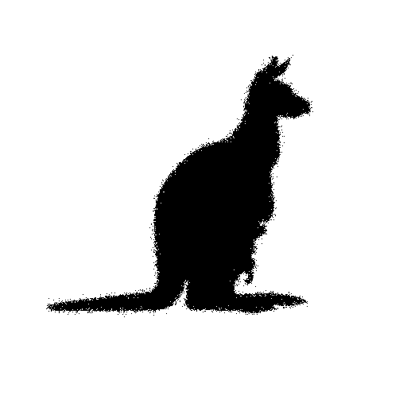
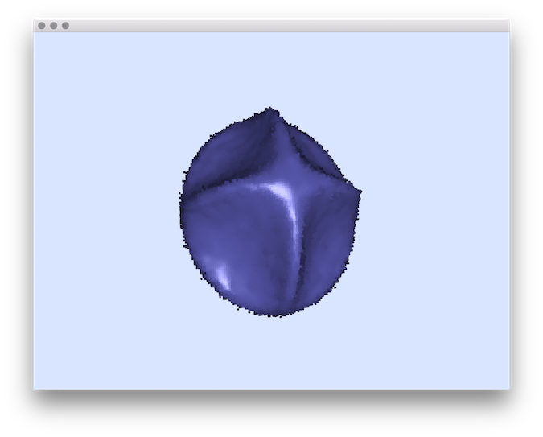
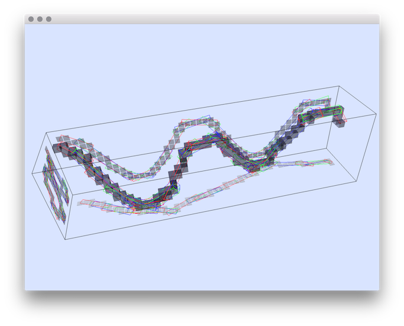
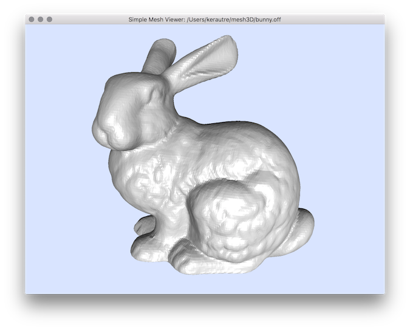
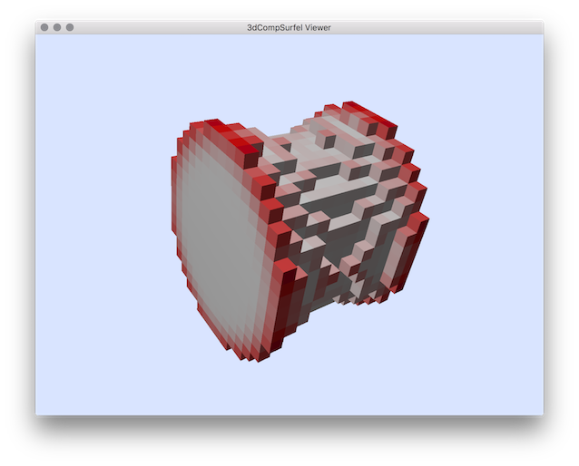
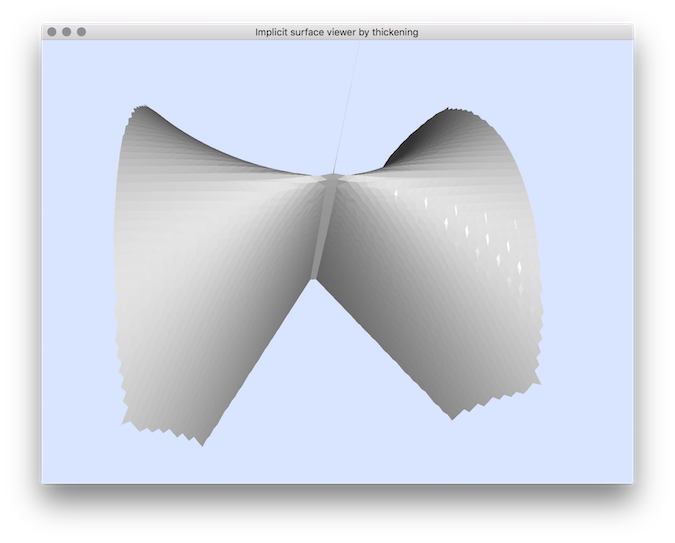
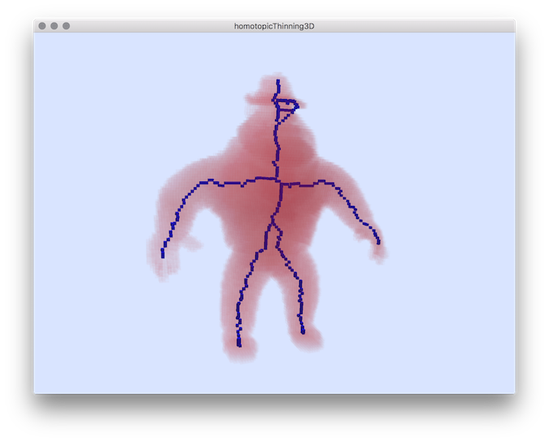
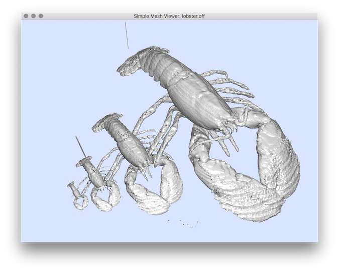
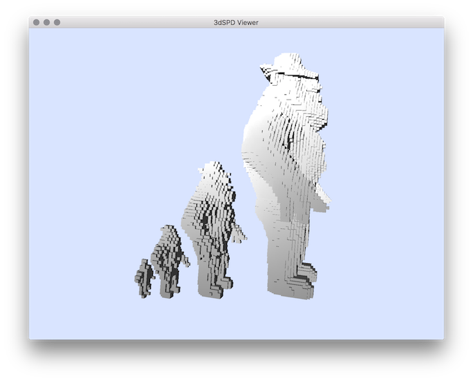
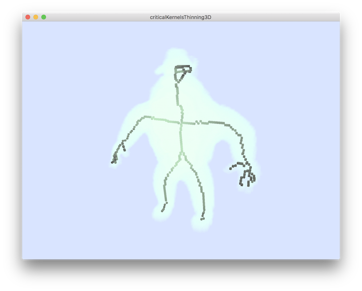

DGtalTools
==========
DGtalTools is a separate github project containing tools constructed
using DGtal library. The main goal of this part is to gather simple
and useful tools exploiting the structures and algorithms defined in
DGtal. The resulting tools could be useful to:

- Share and apply DGtal algorithms to various data from different domains.

- Construct demonstration tools like online demonstrations (as for instance the one of the Image Processing Online (http://www.ipol.im)

- Simplify comparisons of different algorithms with an single framework.

- Provide useful tools of digital image related algorithms (extraction
  of connected components, digital contour/surface extraction, simple
  visualization tools ... etc).

The source code of the tools can also be used to non DGtal familiar
user to show how to include the DGtal library framework directly in their
own source code (in complement of DGtal tutorial https://dgtal-team.github.io/doc-nightly/packageTutorials.html).

More Information
----------------
* Related DGtalTools-contrib: https://github.com/DGtal-team/DGtalTools-contrib
* Release 2.1 
* Release 2.0 
* Release 1.4 
* Release 1.3 
* Release 1.2 
* Release 1.1 
* Release 1.0 
* Release 0.9.4.1 
* Release 0.9.4 
* Release 0.9.3 
* Release 0.9.2 
* Release 0.9.1 
* Release 0.9 
* Release 0.8 
* Continuous Integration (Linux/MacOS/Windows) 

Documentation
==============

The description and documentation of the tools are available [here](https://dgtal-team.github.io/doctools-nightly). 

Actually the DGTal project is organized as follows:

 - [Converters](https://dgtal-team.github.io/doctools-nightly/converters.html#converters):
   utilities to convert various simple file formats (for instance vol2raw, dicom2vol, mesh2heightfield ...)
   
 - [Estimators](https://dgtal-team.github.io/doctools-nightly/estimators.html#estimators_Doc):
   different geometric estimators (like tangent, curvature 2D/3D...)

 - [Generators](https://dgtal-team.github.io/doctools-nightly/generators.html):
   utilities to generate various contours/shapes

 - [Visualization](https://dgtal-team.github.io/doctools-nightly/visualization.html#visualization_Doc):
   various tools to visualize digital data (set of voxels, vol file, heightmap ... )
   

 - [Volumetric](https://dgtal-team.github.io/doctools-nightly/volumetric.html#volumetric_Doc): 
   tools to manipulate volumetric files (marching cube, sub sampling, thinning)

 - [ImageProcessing](https://dgtal-team.github.io/doctools-nightly/imageProcessing.html): 
   tools to process images (image restoration, image inpainting)

How to build the tools
======================
  - use cmake tool to generate a build script (MakeFile, VS project,..) from the CMakeLists.txt
  - DGtal must be installed in your system. Concerning DGtal dependencies (boost, Qt,...), all the dependencies used to compile your DGtal library must be present to build the DGtalTools.
  
  

Galleries
=========

 - [Converters](https://dgtal-team.github.io/doctools-nightly/converters.html#converters) :
   

   <table>
   <tr>
   <td>  </td>
   <td>  </td>
   <td>  </td>
   <td> </td>
   </tr>
   <tr>
   <td align=center > <a href="https://dgtal-team.github.io/doctools-nightly/group__convertertools.html#vol2heightfield_sec">vol2heighfield</a></td>
   <td align=center ><a href="https://dgtal-team.github.io/doctools-nightly/group__convertertools.html#heightfield2vol_sec">heightfield2vol</a></td>
   <td align=center ><a href="https://dgtal-team.github.io/doctools-nightly/group__convertertools.html#imgAddNoise_sec">imgAddNoise</a></td> 
   <td align=center ><a href="https://dgtal-team.github.io/doctools-nightly/group__convertertools.html#vol2slice_sec">vol2slice</a></td>
   </tr>
   <tr>
   <td>  
   <td align=center>  </td>
   <td> </td>
   </tr>
   <tr>
   <td align=center ><a href="https://dgtal-team.github.io/doctools-nightly/group__convertertools.html#mesh2heightfield_sec"> mesh2heightfield</a></td>
   <td align=center ><a href="https://dgtal-team.github.io/doctools-nightly/group__convertertools.html#heightfield2shading_sec"> heightfield2shading</a></td>
   <td align=center ><a href="https://dgtal-team.github.io/doctools-nightly/group__convertertools.html#vol2sdp_sec"> vol2sdp</a></td>
   </tr>
   <tr>
   </table>
   

 
 
 - [Estimators](https://dgtal-team.github.io/doctools-nightly/estimators.html#estimators_Doc) :
   

   <table>
   <tr>
   <td  align="center" colspan="3"></td>
   </tr>
   <tr>
   <td colspan="3" align=center >Illustration of <a href="https://dgtal-team.github.io/doctools-nightly/group__estimatortools.html#curvatureScaleSpaceBCC_sec"> curvatureScaleSpaceBCC</a> </td>
   </tr>
   <tr>
   <td align=center > </td>
   <td align=center > </td>
   <td align=center>  </td>
   </tr>
   <tr>
   <td colspan="2"> Illustration of <a href="https://https://dgtal-team.github.io/doctools-nightly/group__estimatortools.html#generic3dNormalEstimators_sec">generic3dNormalEstimators</a> on VCM estimator applied on smooth and noisy shapes.</td>
   <td> <a align=center href="https://dgtal-team.github.io/doctools-nightly/group__estimatortools.html#Doc2dLocalEstimators_sec"> 2dLocalEstimators </a> </td>
   </tr>
   <tr> 
   <td> </td>
   <td> </td>
   <td> </td>
   </tr>
   <tr> 
   <td align=center > <a href="https://dgtal-team.github.io/doctools-nightly/group__estimatortools.html#Doc3dCurveTangentEstimator_sec"> 3dCurveTangentEstimator</a> </td>
   <td align=center > <a href="https://dgtal-team.github.io/doctools-nightly/group__estimatortools.html#vol2normalField_sec"> vol2normalField</a> </td>
   <td align=center > <a href="https://dgtal-team.github.io/doctools-nightly/group__estimatortools.html#lengthEstimators_sec"> lengthEstimators</a> </td>
   </tr>
   </table>
   

 - [Generators](https://dgtal-team.github.io/doctools-nightly/generators.html) :
   

   <table>
   <tr>
   <td></td>
   <td></td>
   <td></td>
   </tr>
   <tr>
   <td> grid size = 1</td> <td> grid size= 0.1</td> <td> grid size = 0.01</td>
   </tr>
   <tr>
   <td colspan="3" align=center> <a href="https://dgtal-team.github.io/doctools-nightly/group__generatorstools.html#shapeGenerator_sec">shapeGenerator</a>  
   </tr>
   </table>
   

   
 - [Visualization](https://dgtal-team.github.io/doctools-nightly/visualization.html#visualization_Doc) :
   

   <table>
   <tr>
   <td></td>
   <td></td>
   <td></td>
   <td></td>
   </tr>
   <tr>
   <td align=center > <a href="https://dgtal-team.github.io/doctools-nightly/group__visualizationtools.html#Doc3DCurvatureViewer_sec" > 3dCurvatureViewer</a></td>
   <td align=center > <a href="https://dgtal-team.github.io/doctools-nightly/group__visualizationtools.html#Doc3dCurveViewer_sec" > 3dCurveViewer</a> </td>
   <td align=center > <a href="https://dgtal-team.github.io/doctools-nightly/group__visualizationtools.html#Doc3dImageViewer_sec" > 3dImageViewer</a></td>
   <td align=center > <a href="https://dgtal-team.github.io/doctools-nightly/group__visualizationtools.html#Doc3dVolViewer_sec" > 3dVolViewer</a></td>
   </tr>
   <tr>
   <td></td>
   <td></td>
   <td> </td>
   <td align="center" colspan="2">

</tr>
   <tr>
   <td align=center > <a href="https://dgtal-team.github.io/doctools-nightly/group__visualizationtools.html#displayContours"> displayContours</a></td>
   <td align=center > <a href="https://dgtal-team.github.io/doctools-nightly/group__visualizationtools.html#meshViewer"> meshViewer</a></td>
   <td align=center > <a href="https://dgtal-team.github.io/doctools-nightly/group__visualizationtools.html#Doc3DSDPViewer"> 3dSDPViewer</a></td>
   <td  align="center" colspan="2"><a href="https://dgtal-team.github.io/doctools-nightly/group__visualizationtools.html#DocVolscope_sec">volScope</a>  </td>
   </tr>
   <tr>
   <td>
   <td>
   <td align="center" colspan="2">
   </tr>

<tr>
   <td align=center ><a href="https://dgtal-team.github.io/doctools-nightly/group__visualizationtools.html#Doc3dHeightMapViewer_sec" > 3dHeightMapViewer</a></td>
   <td align=center  ><a href="https://dgtal-team.github.io/doctools-nightly/group__visualizationtools.html#Doc3DCompSurfelData_sec" > 3dCompSurfelData</a></td>
   <td  align="center" colspan="2"><a href="https://dgtal-team.github.io/doctools-nightly/group__visualizationtools.html#Doc3dImplicitSurfaceExtractorByThickening_sec" > 3dImplicitSurfaceExtractorByThickening</a> </td>
   </tr>
<tr>
</tr>
      <tr>

</tr>
   </table>
   

 - [Volumetric](https://dgtal-team.github.io/doctools-nightly/volumetric.html#volumetric_Doc) :
   

   <table>
   <tr>
   <td>  </td>
   <td>  </td>
   <td>  </td>
   </tr>
   <tr>
   <td align="center"><a href="https://dgtal-team.github.io/doctools-nightly/group__volumetrictools.html#Doc3dVolMarchingCubes_sec"> 3dVolMarchingCubes </a> </td>
   <td align="center"><a href="https://dgtal-team.github.io/doctools-nightly/group__volumetrictools.html#homotopicThinning3D_sec"> homotopicThinning3D </a> </td>
   <td align="center"><a href="https://dgtal-team.github.io/doctools-nightly/group__volumetrictools.html#volSubSample_sec"> volSubSample </a> </td>
   </tr>
   <tr>
   <td align=center >  </td>
   <td align=center >  </td>
   <td align=center >  </td>
   </tr>
   <tr>
   <td align=center ><a href="https://dgtal-team.github.io/doctools-nightly/group__volumetrictools.html#volReSample_sec"> volReSample </a> </td>
   <td align=center ><a href="https://dgtal-team.github.io/doctools-nightly/group__volumetrictools.html#volTrValues_sec"> volTrValues </a> </td>
   <td align=center ><a href="https://dgtal-team.github.io/doctools-nightly/group__volumetrictools.html#volSegment_sec"> volSegment </a> </td>
   </tr>
   <tr>
   <td align=center >  </td>
   </tr>
   <tr>
   <td align=center  ><a href="https://dgtal-team.github.io/doctools-nightly/group__volumetrictools.html#criticalKernelsThinning3D_sec"> criticalKernelsThinning3D </a> </td>
   </tr>
   </table>
   

